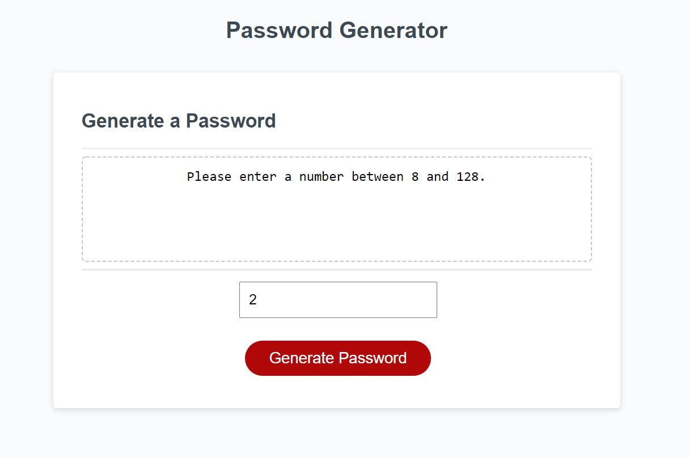

# password-generator
https://mhowitz.github.io/password-generator/

## Description

This project was created so that a user who deploys this website can generate a random password with their desired length and characters. The user is allowed to choose between lowercase letters, uppercase letters, symbols, and numbers. They are requuired to have a password length in between 8 and 128 characters and must choose at least one character option. 

I built this project to learn more about JavaScript. It helped me grasp the concepts of functions, variables, the DOM, and for loops. 

The majority of this project was created using JavaScript. I had to tackle quite a few issues in order to complete this project. One was if I should create a function for each of the character options. I decided the most efficient method was do assign each character to a variable. I also had trouble getting the password length property to work, so I created a text box for the user to submit a number for how long they wanted their password to be rather than a window.prompt() where the input is a string. I spent a lot of time deciding if I wanted to keep the password generator function in one function or separate it into multiple. Once I gain more experience with JavaScript, I might find more efficient ways to solve these issues, but I was able to create a working password generator in the end.  

## Installation

Click the github URL link to view the website. To view the code, click the link to the github repository. Download the repository to your computer and unzip the file. Open the index.html file to view the HTML code. Open the style.css file to view the style sheet. Open the script.js file to view the JavaScript code.

## Usage

When the link is deployed. The password generator is shown:

From here, the user is prompted to enter a password length between 8 and 128 characters. If the user doees not enter a number between 8 and 128, or if they leave the form empty, a message is shown to enter a valid password length:

Once the user enters a valid length, then there are multiple window prompts asking the user if they want to include lowercase letters, uppercase letters, numbers, or special characters. Here is a screenshot of what the first prompt looks like:

If they press confirm on all of the prompts, then the password will include all of the characters and the application will generate a password:

If the user wishes, they are allowed to only do numbers, or whichever combinations they want to do:

If the user does not confirm that they want any characters, an alert and a message will be displayed telling the user to try again:

## Credits

## License
MIT License

Copyright (c) 2021 Mikayla Howitz

Permission is hereby granted, free of charge, to any person obtaining a copy of this software and associated documentation files (the "Software"), to deal in the Software without restriction, including without limitation the rights to use, copy, modify, merge, publish, distribute, sublicense, and/or sell copies of the Software, and to permit persons to whom the Software is furnished to do so, subject to the following conditions:

The above copyright notice and this permission notice shall be included in all copies or substantial portions of the Software.

THE SOFTWARE IS PROVIDED "AS IS", WITHOUT WARRANTY OF ANY KIND, EXPRESS OR IMPLIED, INCLUDING BUT NOT LIMITED TO THE WARRANTIES OF MERCHANTABILITY, FITNESS FOR A PARTICULAR PURPOSE AND NONINFRINGEMENT. IN NO EVENT SHALL THE AUTHORS OR COPYRIGHT HOLDERS BE LIABLE FOR ANY CLAIM, DAMAGES OR OTHER LIABILITY, WHETHER IN AN ACTION OF CONTRACT, TORT OR OTHERWISE, ARISING FROM, OUT OF OR IN CONNECTION WITH THE SOFTWARE OR THE USE OR OTHER DEALINGS IN THE SOFTWARE.
